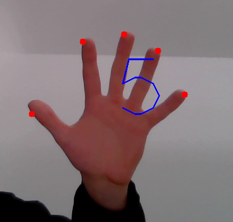

# fingerCount
This programm can count the fingers you are holding in your webcam.

## Motivation
This project was build during the course image processing of my studies.

## Screenshots

## Framework used
- [OpenCV](https://opencv.org/)

## Features
- Face detection
- Fingertip detection
- Print finger count

## How to use?
1. Clone the repository
2. Run `python3 finger_detection.py`
3. Place your hand over the rectangles
4. Press 'c' on your keyboard
5. Your Fingers should get detected
6. Press 'd' on your keyboard to close the programm
